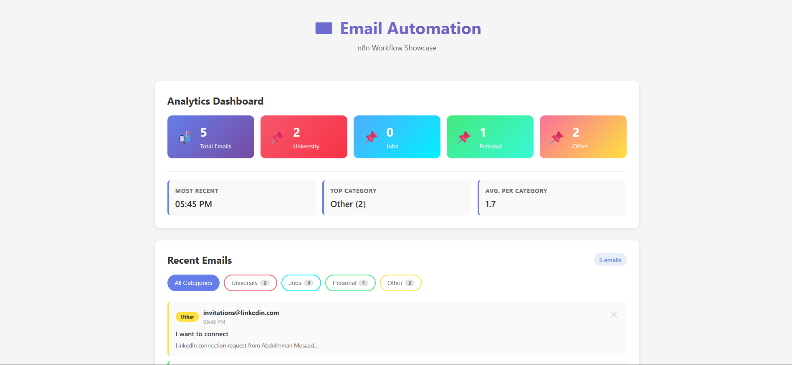

# Email Automation Dashboard



A modern n8n workflow showcase project for categorizing, analyzing, and displaying emails with a beautiful dashboard UI.

## Features

✨ **Email Categorization** - Receives emails categorized into: University, Jobs, Personal, Other

📊 **Analytics Dashboard** - Real-time stats with insights (most recent, top category, averages)

👁️ **Email Detail View** - Click any email to view full details: sender, subject, summary, timestamp

🏷️ **Category Filtering** - Filter emails by category with live counts

🧪 **Input Validation** - Strict Pydantic schema validation for request data

🔍 **Debug Logging** - Comprehensive logging for troubleshooting

🎨 **Modern UI** - Responsive design with smooth animations and color-coded categories

⚡ **Fast Backend** - Flask API with SQLite database and CORS support

🔄 **Auto-refresh** - Dashboard updates every 30 seconds

🌐 **Network Exposure** - Ready for ngrok/Cloudflare Tunnel to expose to cloud services

## Project Structure

```
email-automation/
├── backend/          # Flask API
│   ├── app.py       # Main application
│   └── requirements.txt
└── frontend/         # Vue.js Dashboard
    ├── src/
    │   ├── App.vue  # Main component
    │   └── main.js
    ├── package.json
    ├── vite.config.js
    └── index.html
```

## Quick Start

### Backend Setup

```bash
cd backend

# Create virtual environment (Windows)
python -m venv venv
venv\Scripts\activate

# Or with bash/PowerShell
python -m venv venv
source venv/Scripts/activate

# Install dependencies
pip install -r requirements.txt

# Run server
python app.py
```

Backend runs on `http://localhost:5000`

**Dependencies:**
- Flask 3.0.0 - Web framework
- Flask-CORS 4.0.0 - Cross-origin support
- Pydantic 2.5.0 - Data validation using Python type hints

### Frontend Setup

```bash
cd frontend

# Install dependencies
npm install

# Run dev server
npm run dev
```

Frontend runs on `http://localhost:3000`

## API Endpoints

### Core Endpoints

| Endpoint | Method | Purpose |
|----------|--------|---------|
| `/api/emails` | POST | Submit an email (called by n8n) |
| `/api/emails` | GET | Retrieve all emails |
| `/api/emails/<id>` | DELETE | Delete an email by ID |
| `/api/analytics` | GET | Get email statistics by category |
| `/api/test` | GET/POST | Test endpoint for debugging |
| `/health` | GET | Health check |

### Response Examples

**POST /api/emails** (Success):
```json
{
  "success": true,
  "id": 1
}
```

**POST /api/emails** (Validation Error):
```json
{
  "error": "Invalid request data",
  "details": [...],
  "received": {...}
}
```

**GET /api/analytics**:
```json
{
  "total": 10,
  "by_category": {
    "University": 4,
    "Jobs": 3,
    "Personal": 2,
    "Other": 1
  },
  "categories": ["University", "Jobs", "Personal", "Other"]
}
```

## Frontend Features

### Dashboard Analytics
- **Total Email Count** - Overall email volume
- **Category Breakdown** - Emails per category with visual cards
- **Top Category** - Highest email category
- **Average per Category** - Distribution metric
- **Most Recent** - Timestamp of latest email

### Email Filtering
- Filter emails by category with instant counts
- "All Categories" view shows everything
- Each filter button displays the count of emails in that category
- Color-coded filters match email category colors

### Email Details
- Click any email to open detailed view modal
- View complete sender information
- Read full email subject (no truncation)
- Read full email summary/body
- See exact received timestamp
- Email ID reference
- Delete button within modal

### Real-time Updates
- Dashboard refreshes every 30 seconds
- Analytics update automatically
- New emails appear instantly when received

## Debugging

### Enable Verbose Logging

The backend includes comprehensive logging. Check the Flask terminal output for:
- Request receipt confirmation
- Content-Type headers
- Raw JSON data
- Parsed values
- Validation errors with details
- Database operation logs

### Test the Backend

```bash
# Test if backend is running
curl http://localhost:5000/health

# Test with ngrok (when exposed)
curl https://a1b2c3d4e5f6.ngrok.io/health
```

### Use the Test Endpoint

Send a test request to verify CORS and connectivity:

```bash
curl -X POST http://localhost:5000/api/test \
  -H "Content-Type: application/json" \
  -d '{"test": "data"}'
```

Expected response shows what was received on the backend.

## Troubleshooting

### Issue: "Connection refused" from n8n
**Problem:** ngrok tunnel not running  
**Solution:** Start ngrok with `ngrok http 5000` and verify the URL is correct in n8n configuration

### Issue: CORS errors
**Problem:** Frontend/n8n can't reach backend  
**Solution:** Ensure backend is running and uses the full ngrok HTTPS URL

### Issue: Validation errors in responses
**Problem:** Submitted data doesn't match schema  
**Solution:** Check all required fields are present and match expected types:
- All fields must be strings
- `category` must be exactly: "University", "Jobs", "Personal", or "Other"
- `subject` and `summary` cannot be empty
- Check backslash/special characters aren't breaking JSON

### Issue: Emails saved but missing data
**Problem:** Summary field not appearing in database  
**Solution:** This was fixed in a recent update. Ensure you're running the latest `app.py`

### Issue: Can't find received emails
**Problem:** Email appears submitted but doesn't show in UI  
**Solution:** 
- Check the Analytics tab for the count (may need to refresh)
- Look at database: `emails.db` file in backend folder
- Check browser console for JavaScript errors
- Use ngrok dashboard to inspect the webhook payload

## Recent Updates

- ✅ Added Pydantic schema validation for strict input validation
- ✅ Fixed missing `summary` field bug in database insert
- ✅ Enhanced CORS configuration for cloud services (ngrok)
- ✅ Added comprehensive logging for debugging
- ✅ Added `/api/test` endpoint for connectivity testing
- ✅ Enhanced UI with email detail modal
- ✅ Added analytics dashboard with insights
- ✅ Implemented category filtering with counts
- ✅ Improved error responses with received data details
- ✅ Modern, responsive UI with smooth animations

## Using with n8n (Cloud-based)

Since n8n is typically cloud-hosted, you need to expose your local backend to the internet.

### Step 1: Expose Backend with ngrok

ngrok creates a public URL that forwards to your localhost, allowing n8n to reach your backend.

**Install ngrok:**
- Download from https://ngrok.com
- Or with Chocolatey: `choco install ngrok`

**Start ngrok tunnel:**
```bash
ngrok http 5000
```

You'll see output like:
```
Forwarding    https://a1b2c3d4e5f6.ngrok.io -> http://localhost:5000
```

**Your webhook URL is:** `https://a1b2c3d4e5f6.ngrok.io/api/emails`

> **Note:** ngrok URLs change on restart. Use the new URL if you restart ngrok.

### Step 2: Configure n8n Webhook

1. In your n8n workflow, add an **HTTP Request** node
2. Configure with:
   - **Method**: POST
   - **URL**: `https://a1b2c3d4e5f6.ngrok.io/api/emails` (replace with your ngrok URL)
   - **Authentication**: None (or add as needed)

### Step 3: Test Connection

Before configuring n8n fully, test the connection:

**Test Endpoint:** `https://a1b2c3d4e5f6.ngrok.io/api/test`

This endpoint echoes back whatever data you send and confirms CORS is working.

### Request Schema

Your payload **must** include all required fields with the correct types:

```json
{
  "sender": "email@example.com",
  "subject": "Email Subject",
  "category": "University",
  "summary": "Full email body or summary text"
}
```

**Field Requirements:**
- `sender` (string, optional) - Email address of sender. Defaults to "Unknown" if omitted
- `subject` (string, required) - Email subject line (1-500 characters)
- `category` (string, required) - Must be one of: `University`, `Jobs`, `Personal`, `Other`
- `summary` (string, required) - Email body or summary (1-5000 characters)

**Validation Errors:** If the schema validation fails, you'll receive a 400 response with details:

```json
{
  "error": "Invalid request data",
  "details": [
    {
      "type": "value_error",
      "loc": ["category"],
      "msg": "Input should be 'University', 'Jobs', 'Personal' or 'Other'"
    }
  ]
}
```

### Example n8n Configuration

If using a Custom Code node in n8n:

```javascript
return {
  "sender": $json.from || $json.sender,
  "subject": $json.subject,
  "category": "University", // or determine dynamically
  "summary": $json.body || $json.text
}
```

Valid categories: `University`, `Jobs`, `Personal`, `Other`

## API Endpoints

### POST /api/emails
Add a new categorized email

Request:
```json
{
  "sender": "john@example.com",
  "subject": "Email Subject",
  "category": "University"
}
```

### GET /api/emails
Get all emails

### GET /api/analytics
Get email statistics

```json
{
  "total": 15,
  "by_category": {
    "University": 5,
    "Jobs": 4,
    "Personal": 5,
    "Other": 1
  },
  "categories": ["University", "Jobs", "Personal", "Other"]
}
```

### DELETE /api/emails/<id>
Delete an email by ID

## Testing

You can test the API with curl:

```bash
# Add email
curl -X POST http://localhost:5000/api/emails \
  -H "Content-Type: application/json" \
  -d '{"sender":"test@example.com","subject":"Test Email","category":"Personal"}'

# Get all emails
curl http://localhost:5000/api/emails

# Get analytics
curl http://localhost:5000/api/analytics

# Delete email (replace 1 with actual ID)
curl -X DELETE http://localhost:5000/api/emails/1
```

## Technology Stack

- **Backend**: Python Flask
- **Frontend**: Vue.js 3
- **Database**: SQLite
- **Build Tool**: Vite
- **API**: RESTful

## Notes

- The database file `emails.db` is created automatically in the backend folder
- The dashboard auto-refreshes every 5 seconds
- No authentication required (for demo purposes)
- CORS enabled for frontend-backend communication

## Next Steps

1. Set up your n8n workflow to fetch emails
2. Add logic to categorize emails (using LLM or rules)
3. Send categorized emails to the webhook
4. Monitor the dashboard

Enjoy showcasing your n8n automation! 🚀
